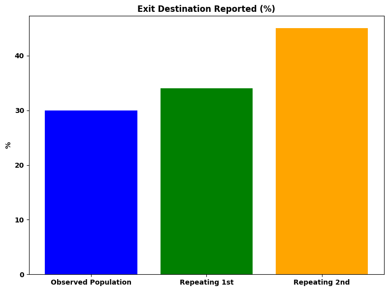
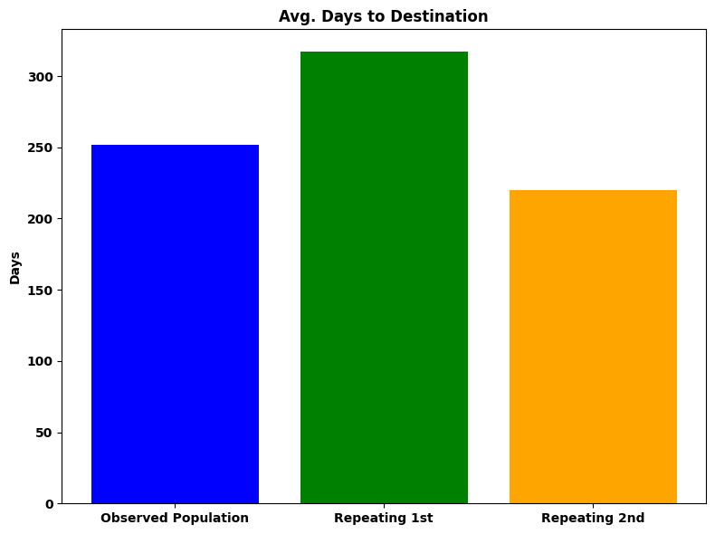
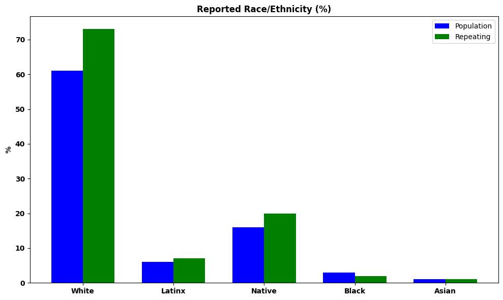
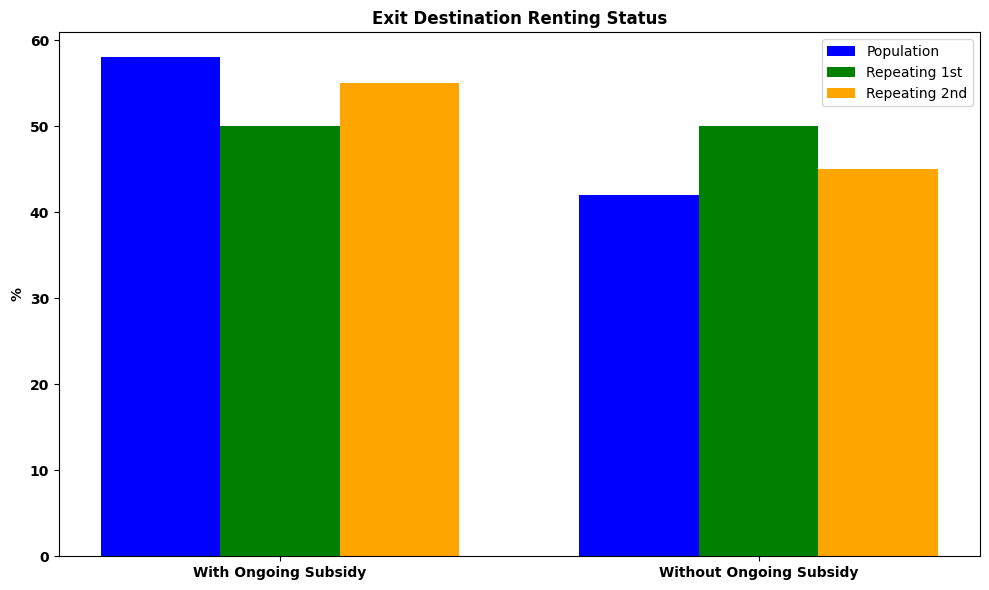

# MSBA_housing_analysis  

Assignment from data storytelling course.  
  
# Comparative Analysis of Exit Destinations Among Individuals Repeatedly Entering/Exiting MCES

## Executive Summary

I chose to examine data on MCES Exit Destinations and compare trends in individuals who enter and exit the system more than once (referred to below as “repeating”) to those of the whole. Around 10% of individuals monitored in this dataset enter and exit the system more than once and careful consideration of what factors may be related to re-entry may offer insights into how to reduce re-entry in the future.

The most significant observed difference is the length of time repeating individuals spend in the system. On average, a repeating individual spends 26% longer in the MCES after their first entry than the observed population, but 14% less time in their second entry-to-exit period. Also of note are differences in race/ethnicity demographics and specific exit destinations. Repeating individuals are 25% more likely to identify as “Native” and 20% more likely to identify as “White” than the observed population. Repeating individuals exit into renting situations at the same rate as the observed population in their first entry-to-exit period, but are 20% less likely to do so with an ongoing housing subsidy. Repeating individuals are also more likely to exit to jail, prison, or a juvenile detention facility.

Further evaluation of these possible relationships may help MCES and its partnered organizations to mitigate factors that may lead to individuals experiencing housing scarcity after leaving the MCES.

## Overview of Analysis

I initiated my analysis by identifying individuals who entered and exited the MCES multiple times during the reporting period (10/29/2022-10/29/2024). The data provided observed 1731 individuals in the reporting period, 166 of whom entered and exited the system more than once. Of these 166 individuals, 11 entered and exited the system three times, and one entered and exited four times. I chose to conduct my comparative analysis on individuals who entered and exited the system more than once and only consider their first two entry-to-exit periods as the sample size for subsequent periods is too small to confidently make any statistical inference. The “repeating individual” subset was compared to the total observed population (as opposed to comparing repeating individuals to those that did not repeat) as individuals with one observed entry-to-exit period may enter the system outside of the reporting period and classifying them as “non-repeating” could skew this analysis.

One brief note about sample size and inference: comparing variables associated with 166 individuals to a population of 1731 may suggest statistical relationships, but the sample size is too small to confidently quantify those relationships. For example; in the observed data, repeating individuals are between 60-80% more likely to exit the system to jail, prison, or juvenile detention that the observed population. This may suggest that repeating individuals are more likely to exit to these destinations, but it would be imprudent to assume that they would do so at similar rates in the future as the number of repeating individuals exiting to these destinations is less than ten. This analysis may identify possible statistical relationships but further data collection and analysis will be necessary for viable inference.
  
  
  
Perhaps the most significant impediment to comprehensive analysis of exit destinations is lack of destination reporting. Exit interviews which reported a destination were only concluded for 30% of individuals in this dataset. Repeating individuals display higher rates of reported destinations, 34% for first entry-to-exit period and 45% for second. This analysis was conducted only on individuals for whom a destination was reported. Efforts to increase destination reporting may significantly improve future analysis.
  
  
  
Repeating individuals displayed a significant difference in entry-to-exit time than the observed population. The average number of “days to destination” in the observed population is 252. Among repeating individuals, this average is 317 days for their first entry-to-exit period, 26% longer than the observed population, but only 220 days, 14% shorter than the observed population, for their second. This suggests that individuals who spend significantly longer than average in the system may be more likely to re-enter.

Repeating individuals were 67% more likely than the observed population to display propensity towards chronic unhoused status, as reported in the “Chronicity” field in this dataset, suggesting that this evaluation is at least moderately accurate. My analysis suggests that veterans are not more likely than non-veterans to enter and exit the system multiple times (13% veterancy in both groups) and repeating individuals do not display any significant difference in age from the observed population (average age is 48 for repeating individuals and 47 for the observed population).
  
  
  
Individuals who identified as “Native” and “White” when asked to report their race/ethnicity make up a larger proportion of repeating individuals than the observed population. Individuals identifying as “White” make up 61% of the observed population and 73% of repeating individuals. Individuals identifying as “Native” make up 16% of the observed population and 20% of repeating individuals.
  
  
  
Among repeating individuals for whom exit destinations were recorded, the majority (52%) exited into renting situations and did so at the same rate as the observed population. Repeating individuals who exited into renting situations during their first entry-to-exit period were 20% more likely than the observed population to do so without ongoing housing subsidies. This suggests that there may be a relationship between ongoing housing subsidies and likelihood of re-entry.

